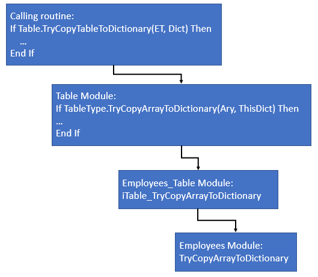
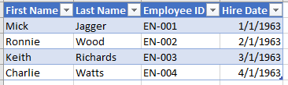

#### Table Management

Excel isn’t designed to be a database manager but many of us use Excel to store and manipulate lists. I’m personally very fond of Excel tables and I use a lot of them. Manipulating Excel tables from VBA can be a challenge. I’ve created some code that lets me convert a table into a VBA dictionary where it’s easier to manipulate and then copy the data back to the table.

The table manipulation code is flexible. It can read/write tables to/from this workbook, other Excel workbooks, or Access. When this writeup describes the source or destination of the data as a "Table",  "Table" can be an Excel table in this workbook, an Excel table in another workbook, or an Access table.

I’ll describe the table manipulation process and show you how to create your own routines to manipulate your own tables. Each table has a code module and an associated class module. There is a pattern to both modules that I have automated into a TableBuilder code generator. I’ll describe the code generator in a separate write-up.

#### How It Works
This is the code you will write in your main program:
```vba
    Dim Dict As Dictionary
    
    Dim ET As Employees_Table
    Set ET = New Employees_Table
    
    If Table.TryCopyTableToDictionary(ET, Dict) Then
        ' Your processing
    End If
```
In your main program, you will call `Table.TryCopyTableToDictionary` to copy data from your table to a VBA dictionary, `Dict`. The `Table` module calls `TableType.TryCopyArrayToDictionary`. In our example, `TableType` is `Employees_Table` (from `ET`). VBA uses `TableType` to determine which class module to call; in our example, this is `Employees_Table`. Specifically, this is `iTable_TryCopyArrayToDictionary` in `Employees_Table` which is a pass-through call to `Employees`. `Employees_Table` calls `TryCopyArrayToDictionary` in the `Employees` module.



It is important to note that `Table` and `iTable` know nothing about the structure (number of columns, column titles, etc.) about your table. `Table` and `iTable` are general purpose modules that can process any table. The particulars of your table are in the `Employees` module that you write. In other words, we can write `Table` and `iTable` once and then use them to process any table by writing the appropriate `Employees` and `Employees_Table` modules for your specific table. Plus, your main program knows nothing about where the data is stored. For example, I have an application where I moved ~15 tables from the primary Excel workbook to Access with no changes to my main program. The workbook shrunk from ~18MB to ~7 MB, stability improved, and the change was invisible to the users.

This general purpose approach to `Table` and `iTable` is what allows this table management code to process tables stored in this workbook, another workbook, or in an Access database. The `Employees` module would need adjusting but `Table` and `iTable` are unchanged; your main program is unchanged. Note: there is code specific to Excel tables and Access databases in `Table` but the programmer's interface to them is unchanged. This flexibility allows you, as the designer, to move your tables from this workbook to another workbook to Access while making no changes to your main program. The only changes are in the modules like `Employees`.

#### Table Module

There is a Table module that handles most of the heavy lifting. There is an interface class module (iTable) that provides an interface specification for each table. Table is written against the interfaces in iTable; this approach allows Table to be generic and manipulate any table regardless of the number of columns or rows and to read/write to/from any table.

The Table module has two primary entrance points: `TryCopyTableToDictionary` and `TryCopyDictionaryToTable`. These are both Boolean functions that return True if they are successful. If they are unsuccessful, you can use the error handling techniques provided in https://github.com/BriargateExcel/Error_Handling. The term “Table” in the function names is general; the table can be an Excel table or a table in an Access database. For example, `TryCopyTableToDictionary` can copy an Excel table from this or another workbook or it can copy an Access table.

#### iTable Module

`iTable` defines 14 routines that are key to making things work. By using `iTable` as an interface class, we can have many tables (as many as we want; I have an application with 24 tables; some of them are in the application workbook and the larger tables are in Access). Each of my tables has a basic and associated class module. The `Table` module is written against `iTable`. You need to define class modules that implement `iTable`.
If you’re not familiar with interface class modules, I recommend Google; I won’t be explaining them here

#### Class Modules

You need to create a class module for each table that implements the 14 interfaces in `iTable`. Each of these class modules is a pass-through to the code module. The class module stores minimal information about the table.

You will create a class module for each of your tables. I'll use Employees as an example table. In Excel, the Employee table looks like the figure below. Remember, this table could be in this workbook, another workbook, or in Access.



At the top of the class module, private variables are declared and `Get/Let Properties` for each field are created.

The routines in `Employees_Table` correspond with the routines in `iTable`:

`iTable_LocalDictionary` calls `Employees.Dict` in the Employees basic module

`iTable_HeaderWidth` calls `Employees.HeaderWidth`

`iTable_Headers` calls `Employees.Headers`

`iTable_Initialized` calls `Employees.Initialized`

`iTable_LocalTable` calls `Employees.SpecificTable`

`iTable_LocalName` returns `"Employees_Table"`

`iTable_TryCopyArrayToDictionary` calls `Employees.TryCopyArrayToDictionary`

`iTable_TryCopyDictionaryToArray` calls `Employees.TryCopyDictionaryToArray`

`iTable_FormatArrayAndWorksheet` calls `Employees.FormatArrayAndWorksheet`

`iTable_CreateKey` calls `Employees.CreateKey`

`iTable_IsDatabase` returns `False` because this is an Excel table not an Access table

`iTable_DatabaseName` returns `vbNullString` because this is an Excel table not an Access table

I used my `TableBuilder`, described elsewhere, to build the basic and class modules for the `Employees` table. `Employees.bas` and  `Employees_Table.cls` are included in this folder.

#### Basic Module

The basic module, `Employees.bas` in our case, does the work for the `Employees` table. `Employees.bas` is where the code for the 14 `iTable` interfaces lives. The elements of `Employees.bas`:

`PrivateType` defines three variables used throughout the module:

`Initialized` specifies whether the dictionary is populated. `Initialized` is referenced in this module as `This.Initialized`.

`Dict` is the dictionary that holds the data in our Employees table. Referenced as `This.Dict`.

`Wkbk` is the workbook where the Employees table lives. If it's an Access database, `Wkbk` is Nothing. Referenced as `This.Wkbk`.

The 5 constants correspond to the positions of each field in the table and the overall width of the table. There are Get properties for each field.

The next 3 constants are used if the table is in another workbook.

`Headers` returns an array with the table's headers.

`Get Dict` returns the dictionary containing the data

`Get SpecificTable` returns the table that contains the data. It's called `LocalTable` in the class module; that's what you'll use in your code.

`Get Initialized` specifies whether the dictionary has been populated

`Initialize` populates the dictionary, `This.Dict`, and sets `This.Initialized` to `True`

`Reset` resets `This.Initialized` and sets `This.Dict` to nothing. Use `Reset` to ensure that the dictionary is re-populated from the table.

`Get HeaderWidth` specifies the width of the table

The next few `Get...FromEmployeeID` functions give you a way to use the key, `Employee ID`, to return specific elements for an employee.

The `CreateKey` routine creates the key used in the dictionary, `This.Dict`. In this case, the key is one field. You can create keys from multiple fields if necessary.

`TryCopyDictionaryToArray` copies `This.Dict` to an array. The `Table` module uses this during the `TryCopyDictionaryToTable` processing.

`TryCopyArrayToDictionary` copies an array to `This.Dict`. The Table module uses this during the `TryCopyTableToDictionary` processing.

`CheckEmployeeIDExists` determines whether the key, `Employee ID` in our case, exists in `This.Dict`.

`FormatArrayAndWorksheet` is used during the Table's `TryCopyDictionaryToDictionary` processing to properly format the table. In our case, there is no special formatting required.

#### How To Use the Table Manager

**Setup:**

Create the table, `EmployeesTable` (above) in our case

Add a reference to Microsoft Scripting Runtime to get the dictionary routines

Add a reference to Microsoft Office 16.0 Access database engine Object to get the Access routines

Set the `CodeName` for the worksheet containing the table to `EmployeesSheet` in our case

Create the `Employees` basic module and the `Employees_Table` class module.

**Usage:**

In your code, use `Table.TryCopyTableToDictionary` to copy the table to a VBA dictionary. This should look something like this:

```vba
    Dim Dict As Dictionary
    
    Dim ET As Employees_Table
    Set ET = New Employees_Table
    
    If Table.TryCopyTableToDictionary(ET, Dict) Then
        ' Your code
    End If
```

`Table` defaults to using the table specified in the `Employees` module by calling the `LocalTable` in `Employees_Table`. The `EmployeesTable` is now loaded into `Dict`. You can now use VBA dictionary manipulation routines to manipulate the dictionary. For example:

```vba
    Dim Entry As Variant
    Dim Employee As Employees_Table
    
    For Each Entry In Dict
        Set Employee = Dict(Entry)
        Debug.Print Employee.FirstName, Employee.LastName, _
            Employee.EmployeeID, Employee.HireDate
    Next Entry
```

Which produces in the Immediate Window (Ctrl-G):

```
Mick          Jagger        EN-001        1/1/1963 
Ronnie        Wood          EN-002        2/1/1963 
Keith         Richards      EN-003        3/1/1963 
Charlie       Watts         EN-004        4/1/1963 

```

**Why?**

- Dictionary manipulation is faster than manipulating the table directly using ListObject
- Dictionary manipulation is faster than retrieving data from an Access table
- Dictionary manipulation is easier than manipulating the table directly using ListObject
- In my opinion, using dictionary field names like `Employee.FirstName` is easier to read and understand than things like `Tbl.DataBodyRange`, `Tbl.ListColumns`, and `Tbl.ListRows`

**Hmmmmmm...**

Most of the code in `Employees` and `Employees_Table` is repetitious. Wouldn't it be nice if it were possible to automatically generate these routines?... See my `TableBuilder` writeup.